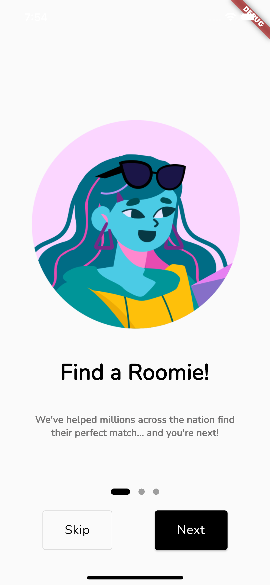
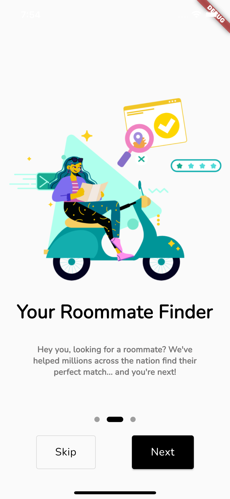
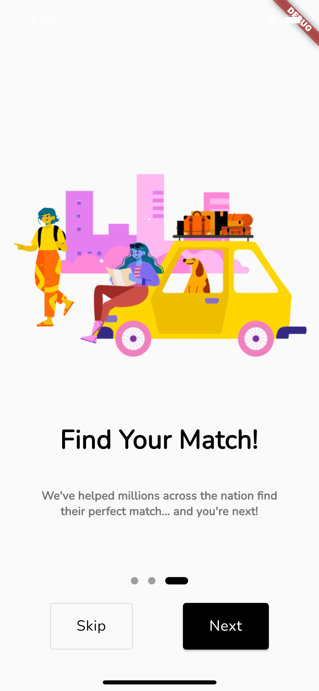
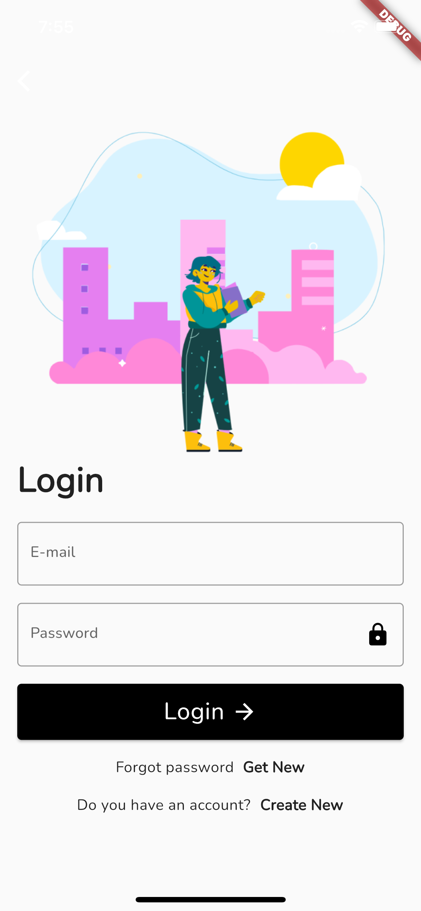
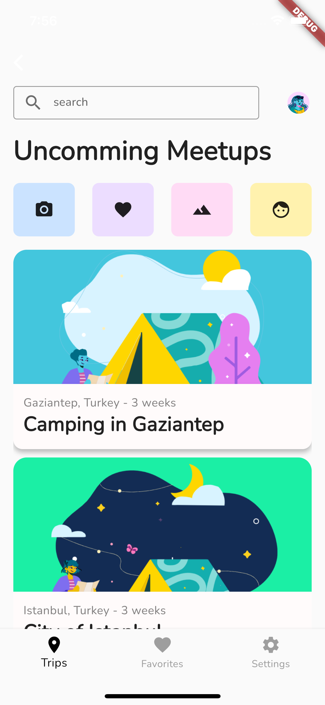
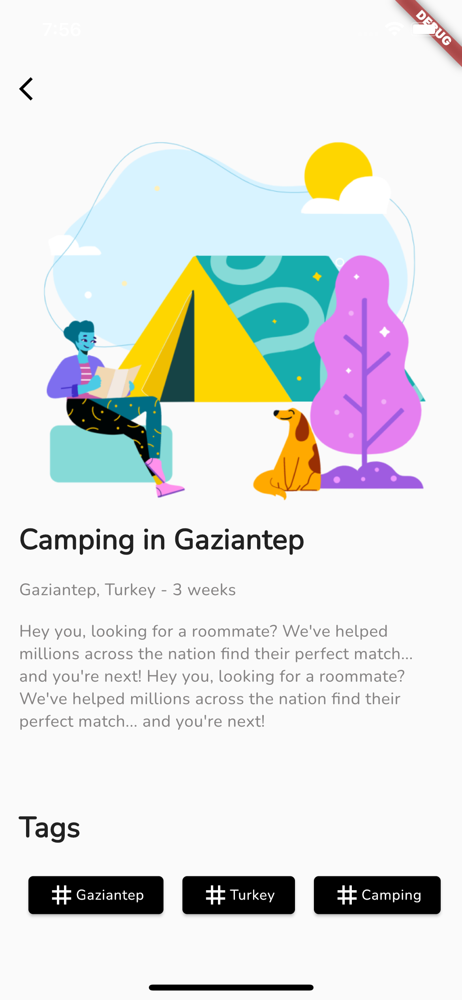
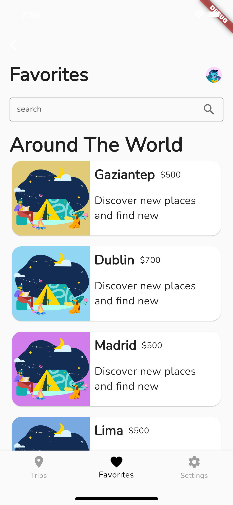

# travel_app

The design was taken for free from figma and coded as a dynamic project with flutter.

## Screenshots

    
    
    
    
    
    
    

## GIF

## UI  

https://www.figma.com/file/4FjPcGVeVAqV9t7VdlFGYT/Travel-App-Template-with-Nomads-Illustrations-(Community)?node-id=568%3A63

